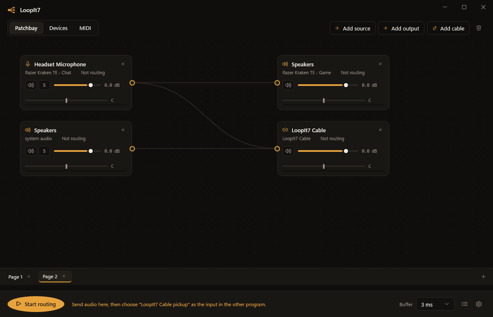
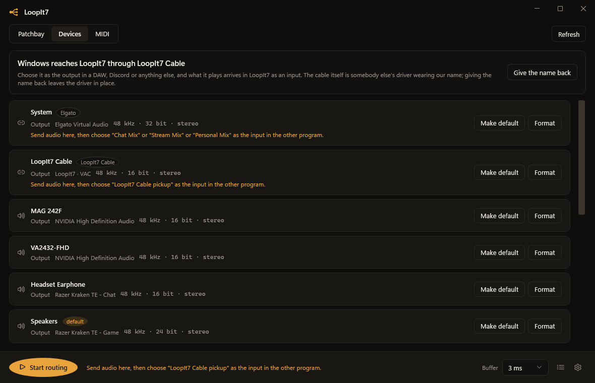
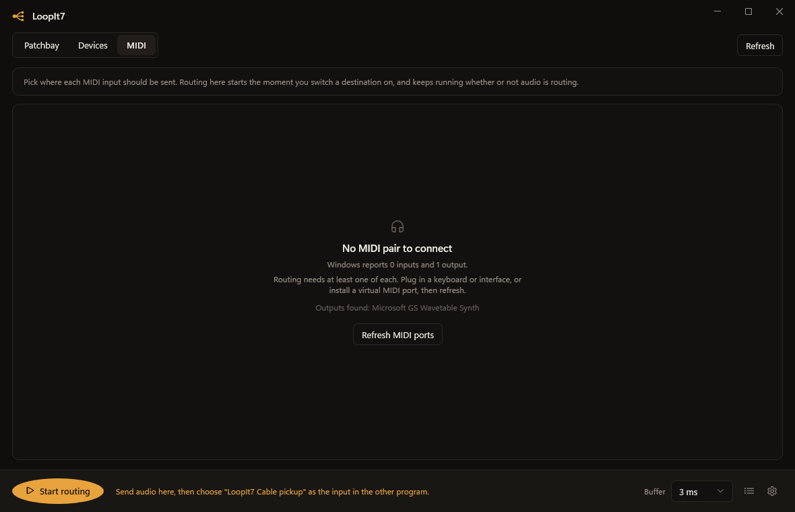

<div align="center">


**A patchbay for Windows audio. Name your own outputs, send programs to them, and fan them
out anywhere.**

[](https://github.com/SeventhSG/LoopIt7/actions/workflows/build.yml)
[](https://github.com/SeventhSG/LoopIt7/releases/latest)
[](https://github.com/SeventhSG/LoopIt7/releases)
[](LICENSE)
[](#requirements)

### [Download LoopIt7 Setup](https://github.com/SeventhSG/LoopIt7/releases/latest)

2.3 MB. Installs for the current user, so there is no admin prompt.

</div>

---



## What it is

Windows gives you one output at a time and no way to see where your audio is going. LoopIt7
puts every microphone, speaker, headset, interface and running program on one canvas and lets
you draw the connections yourself.

One microphone can reach your headphones and the room monitors at once. Spotify can go to
Discord without going through your mic. A game can go to the stream but not to your ears. The
meters move while it happens, so you can see which cable is carrying what.

## Virtual outputs

**Make an output of your own, name it, and decide what comes out of it.**

Press **Add virtual output** and call it whatever it is for. *Discord*. *Stream*. *Speakers in
the other room*. Then press the **+** on the box and pick the programs that should play
through it. Each one gets captured on its own and taken off its own output, so it comes out of
your named box instead of where Windows was sending it.

Now pull cables out of that box to as many real outputs as you like. One name, one fader, one
mute, and everything you assigned to it lands everywhere you pointed it.

```
  Discord  ─┐
  Spotify  ─┼──▶  [ Stream ]  ──┬──▶  Headphones
  Mic      ─┘                   └──▶  Elgato Virtual Audio  ──▶  OBS
```

Change where the whole thing goes by moving one cable rather than reaching into three
programs' settings. Virtual outputs can feed each other, and a chain that would close on
itself is refused before it can run away.

**It is a box inside LoopIt7, not a Windows device.** Nothing else on the machine can pick it
from a dropdown, which is exactly why you assign programs to it here rather than there. The
reason for that is a driver, and there is an honest section about it further down.

## What it does

**Sources.** Any recording endpoint, any playback endpoint tapped in loopback, and any single
running program. That last one is the interesting part: LoopIt7 captures one application on
its own, with no virtual cable and no driver, using the process loopback API Windows has
shipped since build 20348. Spotify without the game. The game without Discord.

**Virtual outputs.** A box you name, assign programs to, and fan out to as many real outputs
as you like. It sums whatever arrives, carries its own fader, mute, balance and meter, and
keeps its own clock so it can feed a 44.1 kHz interface and a 48 kHz headset at the same time.

**Destinations.** Any playback endpoint, including software cables that are already installed.
VB-Audio Cable, VoiceMeeter, Elgato Virtual Audio and NVIDIA Broadcast are recognised and
labelled, so you can tell a real speaker from a pipe to another program.

**Cables.** One source can feed many outputs. One output can sum many sources. Every cable has
its own trim, mute and alignment delay, because the speaker across the room is further away
than the one on your desk.

**A real mixer.** Every source and every output has a fader, a mute, a stereo balance and a
live meter. Sources can be soloed, and soloing anything drops everything else, the way a
mixing desk does it. Patching a device's own loopback back into that device is refused
outright, because that is a feedback loop and it arrives in somebody's headphones.

**Only through LoopIt7.** A program you assign to a virtual output is muted in the Windows
volume mixer while routing runs, so you hear it once, where you put it, rather than twice.
The moment routing stops, the box is removed, or LoopIt7 closes, the program gets its own
output straight back. Nothing is left behind in anybody's volume mixer.

**Two starting points.** An empty patchbay offers a **Streaming setup** and a **Monitoring
setup**. Both are built from whatever the machine has, resolved by role at the moment you
press them, so they land somewhere sensible on a laptop with one headset and on a rig with an
interface. Then you change whatever does not fit.

| Workspace | What lives there |
| --- | --- |
| **Patchbay** | The canvas. Boxes you drag, ports you pull cables from, meters that move. Sources on the left, virtual outputs in the middle, real outputs on the right. |
| **Devices** | Every endpoint on the machine, with its sample rate, bit depth and channel count. Set the default device or change the shared engine format without opening three dialogs. |
| **MIDI** | Route any MIDI input to any set of MIDI outputs. The half of Apple's Audio MIDI Setup that Windows never had a window for. |

Plus the things a tool you leave open all day needs: presets, a tray icon, start with Windows,
a global mute hotkey, and reconnection on its own when a device is unplugged and plugged back
in.

<div align="center">


</div>

## About virtual devices, honestly

On macOS, Loopback creates its own virtual devices. It can do that because it ships a kernel
extension. Windows works the same way and offers no shortcut.

An audio endpoint on Windows comes from a kernel mode driver. There is no user mode API that
adds one, and Windows 11 x64 will not load an unsigned driver. Any program claiming otherwise
is either installing a driver of its own or using one that is already there.

So LoopIt7 does not pretend. It does everything that does not need a driver, and it does it
without asking you to install anything:

- Per application capture, driver free.
- Device loopback, driver free.
- Any output as a destination, driver free.
- Virtual outputs of your own, driver free.

That last one is worth being precise about, because the name invites the wrong idea. On its
own, a LoopIt7 virtual output is a **box inside LoopIt7**. It does not appear in the Windows
sound settings and no program can select it, because a device on Windows comes from a kernel
driver and nothing in user space can add one. What the box does instead is take programs in on
the LoopIt7 side: you assign them, LoopIt7 captures each one, mutes it where Windows was
sending it, and plays the sum wherever you have pointed the box.

**A way in from Windows.** Add source lists **From another program** at the top: that is a
cable, and picking one puts a box on the canvas fed by whatever is playing into it. A cable is
a free driver with two ends. The other program sends to one end, LoopIt7 listens on the other,
and what arrives is a source like any microphone, ready to patch to as many outputs as you
like. This is the half a DAW wants: set your output device to **LoopIt7 Cable** and the DAW is
on the canvas.

The same cable can instead be given to a virtual output, with the link button on the box, if
you want what arrives to be summed with other programs before it leaves. Either way the picker
lists the ends as pairs, so nothing is guessed, and if there is no cable on the machine it says
so and offers to fetch one.

**What it is called.** A cable LoopIt7 installed is named **LoopIt7 Cable** the first time the
app sees it, without waiting to be asked, because the name is the only handle anybody has on it
from inside a DAW or Discord. Give it to a virtual output and it takes that box's name instead,
so the word in Discord's list is the word on your canvas.

A cable that was already here keeps the name it came with. It is written down in somebody's OBS
scene and their Discord settings, and LoopIt7 has no business renaming it behind their back.
The Devices page will offer to take one over if you want it to, in as many words and naming the
device it would change. Uninstalling puts back every name LoopIt7 changed.

A cable has two ends and Windows never says which belongs to which, which is the quietest way
a routing setup fails. LoopIt7 pairs them for you and says so in plain words: send audio to
this output, then choose *that* input in OBS or Discord. It is on the destination box and in
the Devices list.

You may see community virtual audio drivers advertised as signed. Check what signed means
before you rely on one: a kernel driver has to carry a **Microsoft** attestation signature,
and an ordinary code signing certificate, however legitimate, will still be refused by the
loader with error 52.

Work towards a LoopIt7 cable of our own lives in [`driver/`](driver/README.md), along with a
plain account of what it needs: a WDK, test signing for development, and Microsoft attestation
signing before it can reach anybody else.

## Install

Grab `LoopIt7-Setup.exe` from [Releases](https://github.com/SeventhSG/LoopIt7/releases/latest)
and run it. It installs for the current user, so there is no admin prompt, and it fetches the
.NET 10 desktop runtime if the machine does not have it.

Already have LoopIt7? Run the same file. Setup finds the copy you have, closes it if it is
running, replaces it where it already lives, and leaves your patchbay, presets and options
exactly as they were.

### About the Windows warning

The download is **not code signed**, so SmartScreen shows a blue "Windows protected your PC"
box the first time you run it. Press **More info**, then **Run anyway**.

That is not a workaround, it is the honest state of things: removing that box needs a code
signing certificate from a commercial authority, which costs a few hundred a year and, for the
cheaper kinds, only stops warning once the file has built up download reputation. Signing it
here with a certificate made on this machine would not help, because Windows trusts a
publisher it has never heard of no further than an unsigned file, and shows a worse dialog for
it.

Verify the download instead of trusting it. Every release is built in the open by
[GitHub Actions](https://github.com/SeventhSG/LoopIt7/actions) from the tagged commit in this
repository, and the same workflow signs the app and the installer automatically the moment a
certificate is added to the repository secrets.

### Requirements

- Windows 11, or Windows 10 build 20348 and later for per application capture
- The .NET 10 desktop runtime, which the installer offers to fetch

## How it works

The engine is a graph. Each source opens its own WASAPI capture and converts to stereo float at
its own rate. Each cable owns a ring buffer, a delay line and a fader, and resamples once on
its way to the destination it belongs to. Each destination sums its incoming cables and hands
the result to WASAPI on that endpoint's own clock.

Nothing shares a clock, which is what lets a 44.1 kHz interface and a 48 kHz headset run off
the same microphone without one stalling the other. Cables trim their own queues so drift
between two independent clocks never turns into a monitor mix that is a quarter second late.

```
source ──┬─ cable ─ delay ─ trim ─ resample ─┐
         │                                   ├─ mix ─ channel map ─ WASAPI ─ output
source ──┴─ cable ─ delay ─ trim ─ resample ─┘
```

A virtual output is both halves of that picture at once: it sums its incoming cables like a
destination, then pushes the result down its own outgoing cables like a source. Every other
node rides a clock somebody else owns, a capture endpoint's or a render endpoint's. This one
has neither, so it keeps its own on a timer thread at 48 kHz and renders what the wall clock
says is due. `LoopIt7.exe --self-test` measures exactly that, without opening a device or
making a sound.

```
program ─┐
program ─┼──▶ [ virtual output ] ──┬── cable ──▶ output
mic     ─┘     sum · fader · clock └── cable ──▶ output
```

## Build it yourself

You need the [.NET 10 SDK](https://dotnet.microsoft.com/download/dotnet/10.0). For the
installer you also need [Inno Setup](https://jrsoftware.org/isdl.php).

```powershell
git clone https://github.com/SeventhSG/LoopIt7.git
cd LoopIt7

# App only
dotnet build src\LoopIt7\LoopIt7.csproj -c Release

# Artwork, publish and installer, all the way to dist\
powershell -ExecutionPolicy Bypass -File build\build.ps1
```

`build\make-assets.ps1` draws the icon, the banner and the installer artwork from one set of
geometry, so the mark is never redrawn by hand. `build\screenshot.ps1` captures the running
window for this page.

If something goes wrong, `LoopIt7.exe --self-test` writes a report to
`%AppData%\LoopIt7\self-test.txt` saying what this machine supports and whether capture works.

## Licence

MIT. See [LICENSE](LICENSE).

Built on [NAudio](https://github.com/naudio/NAudio) by Mark Heath.

---

<div align="center">

**Built by [SeventhSG](https://github.com/SeventhSG)**

</div>
